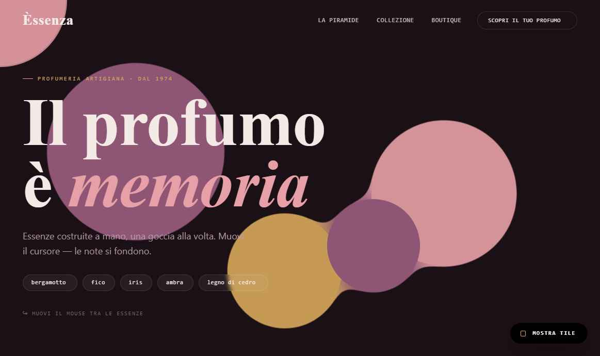
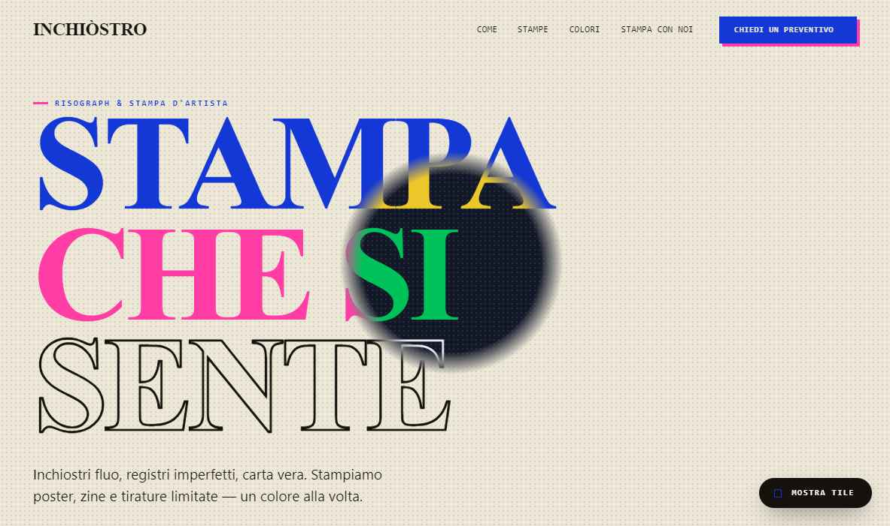
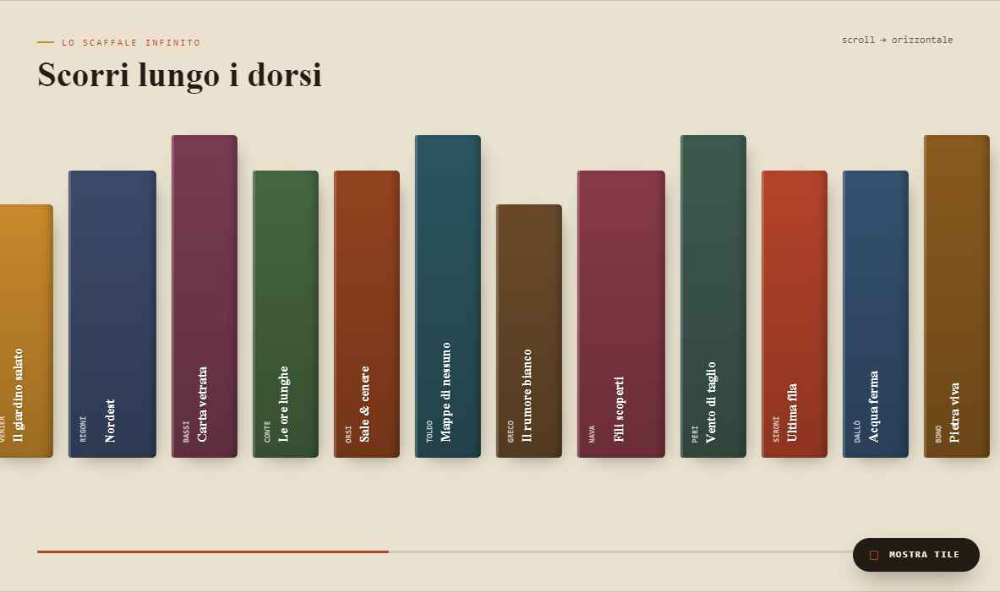
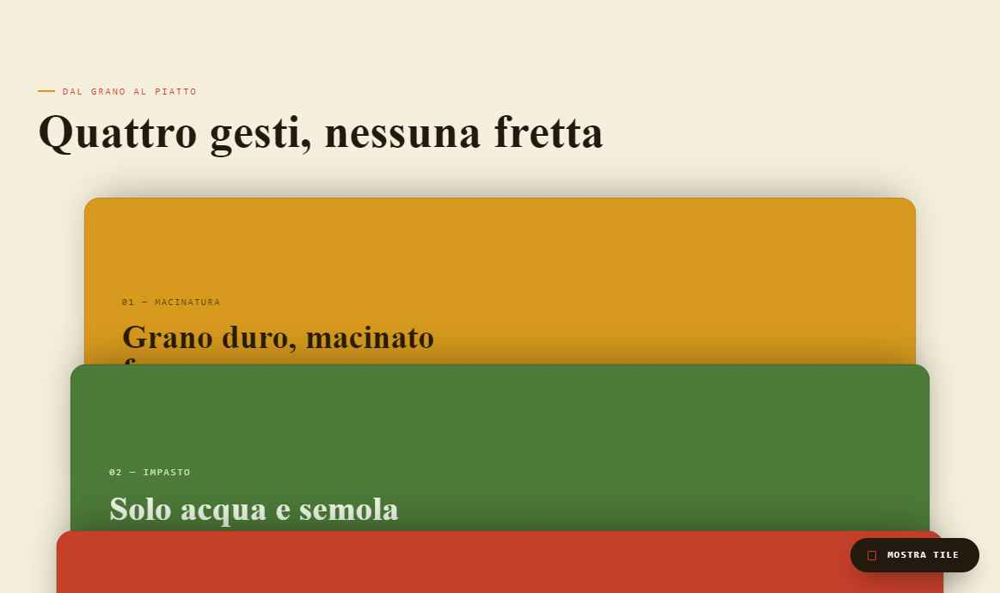
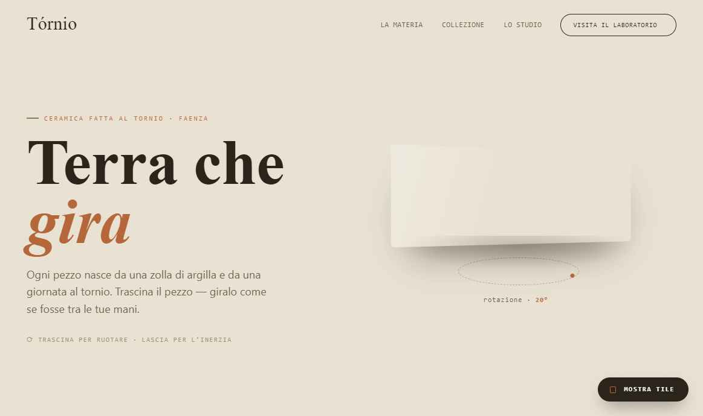
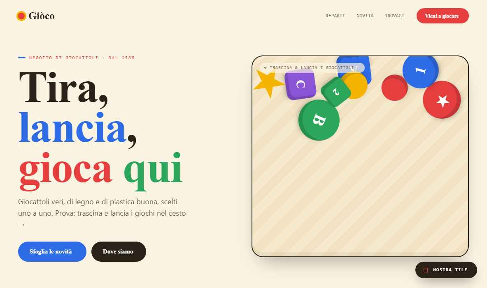
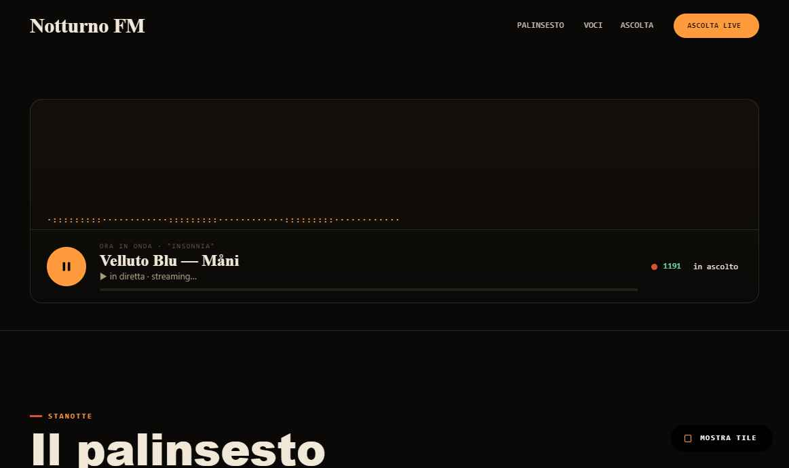
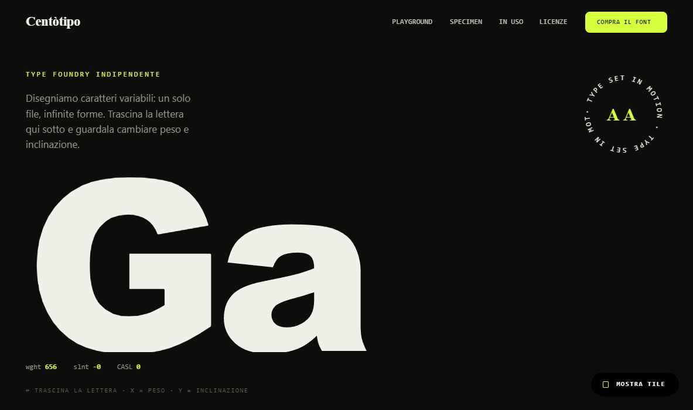
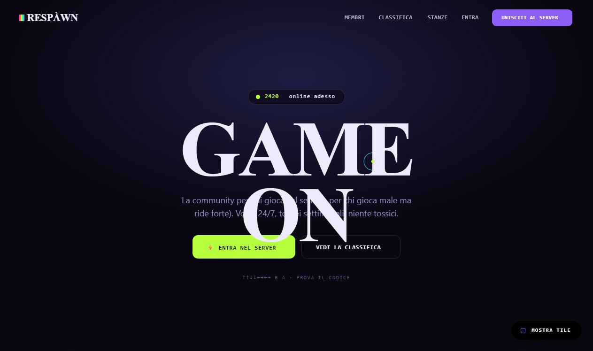

# OLOtheme — Tile speciali dei temi dimostrativi: spec + guida per Claude Code

> **A cosa serve questo documento.** I 50 temi della collana (`/29-temi-collana.html`) sono HTML
> statici che *simulano* siti costruiti con OLObuild. Quasi ogni tema ha un **effetto "wow"** — un
> tile speciale che oggi nel builder **non esiste, esiste solo in parte, o esiste ma va configurato
> in modo non banale**. Quando convertiremo i temi in **template reali** (`wp_olo_templates`), questi
> effetti sono il punto critico: se Claude Code non sa *quale tile usare e come*, la conversione li
> appiattisce o li reinventa male.
>
> Questo file fa tre cose:
> 1. **Raggruppa le caratteristiche obbligatorie** che ogni tile speciale deve avere (il "contratto").
> 2. **Classifica ogni effetto** dei temi in `già coperto / da estendere / nuovo` con il tile target.
> 3. Dà a ogni tile una **scheda operativa** (campi editor, anatomia DOM, runtime di riferimento,
>    fallback, dove implementarlo) così che la conversione sia 1:1 e realistica.
>
> Companion: vedi `PER-CLAUDE-CODE-tile-mancanti.md` per le lacune della pagina di lancio. Le richieste
> qui sono **additive**: nessuna rompe le chiavi salvate o i tile esistenti.

---

## 0. Come usare questo doc durante la conversione

Per ogni `<section data-tile="...">` del tema sorgente:

1. **Leggi l'etichetta `data-tile`.** È già la mappa: `"Marquee · VelocitySkew"`, `"Section · StackScroll"`,
   `"Hero · GooBackground"`, ecc. Il footer di ogni tema (`.f-tiles`) elenca i tile usati e marca i **nuovi**.
2. **Trova l'effetto nella tabella §3** → ottieni il **bucket** (A/B/C) e il **tile OLObuild target**.
3. **Bucket A (già coperto):** istanzia il tile esistente e portane i parametri (vedi scheda → "campi editor").
   Nessun codice nuovo.
4. **Bucket B (estensione):** il tile esiste ma manca un'**opzione**. Aggiungi solo quel campo + il ramo di
   runtime, riusando gli helper. Non duplicare il tile.
5. **Bucket C (nuovo):** scaffold completo (config JS + classe PHP) seguendo §1–§2 e la scheda del tile.
6. **Applica SEMPRE il contratto §2** (responsive, reduced-motion, scoped UID, fallback no-JS).
7. Il **codice di riferimento è già nel tema**: lo snippet runtime in fondo a ogni file `NN-tema-*.html`
   è la prima implementazione funzionante — portala dentro il runner del tile, non riscriverla a memoria.

---

## 1. Ripasso: com'è fatto un tile OLObuild (per non sbagliare lo scaffold)

Dalla scheda tecnica — un tile = **2 file** + registrazione automatica:

| Parte | Dove | Cosa contiene |
|---|---|---|
| **Config** | `src/config/elements/<name>.js` | schema dei **campi editor** (controlli, default, responsive, gruppi), categoria, icona. È quello che l'utente vede nel pannello. |
| **Classe PHP** | `Olo_<Name>_Tile extends Olo_Tile_Base` | `render()` server-side → **HTML statico** (no idratazione). Legge la config, stampa markup con **UID univoco** `olo-<name>-<id>`. |
| **Runtime JS** | runner del tile (caricato on-demand) | comportamento client: init su `DOMContentLoaded`, `IntersectionObserver`, rAF. **Deve supportare N istanze** sulla stessa pagina. |

Regole d'oro dell'architettura (rispettarle o il tile "perde" tra le istanze):
- **Auto-discovery** via `import.meta.glob`: basta creare i 2 file, niente registrazione manuale.
- **Helper centralizzati**, non reinventare: `Olo_Tile_Utils` (border-radius/spacing/shadow/color),
  `Olo_Text_Effects` (gli 11 effetti testo). Glitch e Scramble **esistono già qui**.
- **CSS scoped per istanza** sull'UID — mai selettori globali (`.blob`, `#hero`) come nei demo: nei demo
  vanno bene, in un tile riusabile **no**. Prefissa tutto con `.olo-<name>-<id>`.
- **Per-instance hover/state**: classi UID risolvono il bug "il primo elemento eredita gli stati dell'ultimo".
- **6 breakpoint** su ogni controllo numerico; **36 entrance** + **8 continue** già disponibili come
  animazioni — non ricodificare un float/pulse, riusa il motore.

---

## 2. Il contratto: le 10 caratteristiche che OGNI tile speciale deve avere

Questo è il cuore della richiesta: le caratteristiche *raggruppate* che rendono un effetto demo un tile
vero. Un effetto che non le rispetta **non è convertibile** in modo affidabile.

1. **Parametrico, non hardcoded.** Ogni numero/colore/testo del demo diventa un **campo editor** con
   default sensati. (Es. GooBackground: n° blob, palette, raggio, velocità, intensità "goo".)
2. **Scoped per istanza.** Markup e CSS legati all'UID `olo-<name>-<id>`. Due istanze sulla stessa pagina
   non si calpestano (cursore, canvas, filtri SVG con `id` → l'`id` del filtro deve includere l'UID).
3. **Server-render statico + runtime idempotente.** Il PHP stampa lo stato base **già visibile**; il JS
   *arricchisce*. `init()` deve poter girare su più istanze e non rompersi se chiamato due volte.
4. **`prefers-reduced-motion`.** Tutto ciò che si muove ha un ramo "ridotto": niente loop infiniti, niente
   parallax, niente glitch. Lo stato finale resta leggibile.
5. **Touch & pointer, non solo hover/mouse.** Usa Pointer Events. Gli effetti puntatore (cursore magnetico,
   torcia, goo, water-ripple) **si disattivano** o degradano su `(hover:none)`/`(pointer:coarse)`.
6. **Fallback no-JS / stampa / SSR.** Se il JS non parte: contenuto visibile, immagini al loro posto,
   nessuna sezione vuota. (I demo già lo fanno tenendo il testo nel DOM e animando *da* visibile.)
7. **Responsive 6 breakpoint.** Dimensioni, altezze "pin", numero colonne, font variabili: versioni per bp.
   Gli effetti scroll-pinned vanno **ricalcolati** su `resize`.
8. **Performance.** `IntersectionObserver` per attivare/spegnere (non far girare rAF fuori viewport),
   `will-change` mirato, canvas con `devicePixelRatio` cap, lazy delle immagini. Spegni i loop quando l'istanza
   esce dal viewport.
9. **Accessibilità.** Focus visibile e navigazione da tastiera per gli interattivi (Viewer360, ScratchFX,
   VariableControls), `aria-label`/`role` corretti, contenuto dietro a un canvas sempre disponibile come testo.
10. **Origine dati esplicita (per i dinamici).** PresenceGrid/Leaderboard/NewsTicker non inventano dati:
    sorgente = manuale (repeater) **oppure** query/endpoint (`olo/v1`), con stato demo/placeholder se vuota.

> **Regola pratica:** se per convertire un effetto devi scrivere un numero "magico" nel template invece di
> un campo, hai sbagliato bucket — quel numero è un **controllo** del tile.

---

## 3. Classificazione di tutti gli effetti dei temi

Legenda bucket: **A** = già coperto (configura un tile esistente) · **B** = estendi un tile esistente
(aggiungi un'opzione) · **C** = tile/feature nuovo.

| Effetto (etichetta nei temi) | Temi | Bucket | Tile OLObuild target |
|---|---|:--:|---|
| Glitch RGB titolo | 25, 60 | **A** | `Headline`/`AnimatedHeading` + Text FX **Glitch** (esiste) |
| Text scramble→reveal | 62 | **A** | Text FX **Scramble** (esiste) |
| TextPath rotante (anello) | 66 | **A** | `TextPath` (esiste) — aggiungi solo rotazione continua |
| Marquee / NewsTicker | 31, 60, 64 | **A** | `Marquee`, `NewsTicker` (esistono) |
| ProGallery (masonry/justified/parallax) | molti | **A** | `ProGallery` (10+ layout, esiste) |
| Counter numerici | tutti | **A** | `Counter` (esiste) |
| TiltCard 3D / sheen | 52 | **A** | **Mouse Tilt 3D** (feature globale, esiste) |
| Hero parallax multi-layer | 26, 42, 50 | **A** | **Parallax scroll-linked** (esiste) |
| BreatheFX (anelli respiro) | 54 | **A** | Animazione continua **breathe** (esiste) |
| Palo barbiere / spin infinito | 41 | **A** | Animazione continua **spin** (esiste) |
| Spotlight cursore (luce radiale) | 43 | **B** | `SpotlightFX` → opzione di **Section/Image** (cursor-mask) |
| Blend-difference torcia | 63 | **B** | `BlendText` → modalità **Spotlight** (maschera che segue il cursore) |
| Marquee velocity-skew | 64 | **B** | `Marquee` → opzione **scroll-velocity skew** |
| Viewer360 a trascinamento oggetto | 65 | **B** | `Viewer360` → modalità **object-spin** (oltre HDRI/Street View) |
| ShimmerFX hover galleria | 43 | **B** | `ProGallery`/`OverlayGrid` → preset hover **shimmer** |
| HiddenPop trigger sequenza-tasti (Konami) | 60 | **B** | `HiddenPop` → nuovo trigger **key-sequence** |
| ScrollAssembly (parti che si montano) | 56 | **B** | **Parallax** → preset **assembly** (multi-target su un progress) |
| VinylSpin / FillFX legati a scroll | 55, 59 | **B** | **Parallax scroll-linked** → target `rotate`/`clip` |
| **GooBackground** (metaball cursore) | 61 | **C** | nuovo: sfondo di **Section** "Goo/Metaball" |
| **Aurora background** (blob sfumati) | 45, 48 | **C** | nuovo: sfondo di **Section** "Aurora" (vedi tile-mancanti §2) |
| **MagneticCursor** (cursore custom + pull) | 60 | **C** | nuova **feature globale di tema** (non un tile) |
| **CRTOverlay** (scanline + vignettatura) | 60 | **C** | nuovo **decoratore di Section/pagina** |
| **ScrollScrub / Horizontal pin** | 35, 62 | **C** | nuovo: **Section** modalità **pin orizzontale** |
| **StackScroll** (card sticky impilate) | 64 | **C** | nuovo: **Section/Row** modalità **stack** |
| **PhysicsBin** (drag/throw + gravità) | 69 | **C** | nuovo tile **Interactive** |
| **ASCIIViz** (visualizer audio ASCII) | 67 | **C** | nuovo: modalità di **Audio player** / tile Media |
| **WaterDisplacement** (turbolenza SVG) | 68 | **C** | nuovo: filtro **Image/Section** "Water" |
| **VariableFont morph + controls** | 66 | **C** | nuovo tile **Text** "Variable Specimen" |
| **ParticleFX** (petali/neve/bolle/stelle) | 36, 42, 49, 50 | **C** | nuovo tile **Interactive** "Particles" (preset) |
| **ScratchFX** (gratta e scopri) | 44, 45 | **C** | nuovo tile **Interactive** "Scratch reveal" |
| **PresenceGrid** (avatar online live) | 60 | **C** | nuovo tile **Dynamic** |
| **Leaderboard** (righe + barre XP) | 60 | **C** | nuovo tile **Dynamic/Marketing** |

> Conteggio: **~10 A**, **~7 B**, **~13 C**. La conversione realistica nasce qui: la maggior parte degli
> effetti "wow" è **B o C piccoli** — poche opzioni nuove su tile esistenti, non 50 reimplementazioni.

---

## 4. Schede operative per famiglia

Ogni scheda: **dove** · **bucket** · **cosa fa** · **campi editor** (config JS) · **anatomia DOM** ·
**runtime** (snippet di riferimento già nel tema) · **fallback/a11y** · **note impl**.

---

### Famiglia A — Effetti guidati dal cursore



#### `GooBackground` — sfondo metaball che segue il cursore  · 🆕 C · tema **61**
- **Cosa fa.** Blob di colore che derivano lentamente e si **fondono** (filtro SVG `goo`); un blob extra
  insegue il puntatore, così muovendo il mouse le "gocce" si uniscono e si staccano.
- **Campi editor.** `colors[]` (2–5, palette), `blobCount` (3–8), `blobSizeMin/Max` (px, responsive),
  `driftSpeed` (0–1), `gooStrength` (= `feColorMatrix` alpha, 8–28), `followCursor` (bool), `opacity`.
- **Anatomia.** `.olo-goo-<id>{filter:url(#goo-<id>)}` con N `<div.blob>` + 1 `#cursorBlob`; filtro SVG
  **con id UID-scoped** (`feGaussianBlur`+`feColorMatrix`). Testo del Hero **fuori** dal layer filtrato.
- **Runtime.** rAF: drift sinusoidale per blob + easing del cursor-blob verso `pointermove` (vedi
  `61-tema-profumeria.html`, blocco `goo blobs`). Spegni rAF fuori viewport (IO).
- **Fallback/a11y.** `prefers-reduced-motion` → blob fermi (gradiente statico). `(hover:none)` → niente
  cursor-blob. Solo decorativo: `aria-hidden`.
- **Note.** Sfondo di **Section** (come l'opzione "Aurora" chiesta in tile-mancanti §2): aggiungere "Goo"
  alla stessa tendina `tipo sfondo`. **Id del filtro DEVE essere per-istanza.**



#### `BlendText · Spotlight` — torcia che inverte i colori · ⚙️ B (estende `BlendText`) · tema **63**
- **Cosa fa.** Un disco che segue il cursore con `mix-blend-mode:difference`: sotto di esso i colori si
  invertono. Versione "luce" del BlendText esistente.
- **Campi editor (nuovi sul tile).** `mode: text | spotlight`, `spotlightSize` (px, responsive),
  `softness` (% del gradiente), `blendMode` (`difference`/`exclusion`/`screen`), `followEasing`.
- **Anatomia.** `<div.olo-flash-<id>>` `position:fixed`, `border-radius:50%`, `mix-blend-mode:difference`,
  `pointer-events:none`. (Auto-fix `isolation`/`z-index` come già fa BlendText.)
- **Runtime.** rAF con easing verso `pointermove` (vedi `63-tema-risograph.html`).
- **Fallback/a11y.** `(hover:none)` → disco nascosto, contenuto invariato. Reduced-motion → disco fisso o off.
- **Note.** Riusa lo stesso auto-fix stacking-context di `BlendText`; aggiungi solo il ramo "spotlight".

#### `SpotlightFX` — alone di luce sul cursore · ⚙️ B (opzione Section/Image) · tema **43**
- **Cosa fa.** Maschera radiale chiara che illumina la zona sotto il cursore su immagine/sezione scura.
- **Campi editor.** `radius`, `intensity`, `falloff`, `tint` (colore luce), `mode: lighten | mask`.
- **Runtime.** aggiorna `--mx/--my` (CSS custom props) su `pointermove`; il gradiente usa le variabili.
  Niente rAF necessario (CSS fa il resto). Vedi `43-tema-gioielleria.html` (`#spot`).
- **Note.** Implementabile come **overlay opzionale di Section/Image** → nessun tile nuovo.

#### `WaterDisplacement` — filtro acqua animato + increspatura · 🆕 C · tema **68**
- **Cosa fa.** `feTurbulence`+`feDisplacementMap` SVG animati distorcono un'immagine come acqua; al passaggio
  del cursore l'ampiezza (`scale`) sale e poi si rilassa (ripple).
- **Campi editor.** `baseFrequency` (x/y), `octaves`, `displaceScale` (riposo), `rippleScale` (al cursore),
  `animSpeed`, `target: image | section-bg`.
- **Anatomia.** filtro SVG **id UID-scoped**; wrapper `.olo-water-<id>{filter:url(#water-<id>)}`.
- **Runtime.** easing di `scale` del `feDisplacementMap` verso `rippleScale` su `pointermove`, ritorno a
  `displaceScale` (vedi `68-tema-terme-spa.html`).
- **Fallback/a11y.** Reduced-motion → filtro statico leggero o off (l'immagine resta nitida e visibile).
- **Note.** Opzione **filtro** di Image/Section, sorella di "glassmorphism"/CSS-filters già esistenti.

#### `MagneticCursor` — cursore custom + pull magnetico · 🆕 C (feature di TEMA, non tile) · tema **60**
- **Cosa fa.** Sostituisce il cursore con un anello + dot al neon; sugli elementi `.magnetic` l'anello si
  ingrandisce e l'elemento viene "tirato" verso il puntatore.
- **Campi (a livello tema/global).** `enabled`, `ringSize`, `dotColor`, `ringColor`, `blendMode`,
  `magneticSelector` (default: button, a.btn), `pullStrength`.
- **Fallback/a11y.** `(hover:none)`/`(pointer:coarse)` → cursore di sistema, nessun pull. Non nascondere mai
  il focus tastiera. `cursor:none` solo se il cursore custom è attivo.
- **Note.** È un'**impostazione di tema/header**, non un tile in pagina. Vedi `60-tema-community-gamer.html`.

---

### Famiglia B — Effetti guidati dallo scroll



#### `Section · ScrollScrub` — pin verticale → scorrimento orizzontale · 🆕 C · temi **62, 35**
- **Cosa fa.** Una sezione alta N×100vh resta "incollata" (`sticky`) mentre lo scroll verticale viene
  rimappato a `translateX` di una traccia orizzontale (dorsi di libri, reel di progetti). Con scrubbar.
- **Campi editor.** `scrollLength` (× viewport, 2–6), `align` (start/center), `gap`, `easing`,
  `showProgress` (bool), `pauseOnReducedMotion`.
- **Anatomia.** outer `height:<scrollLength*100>vh` → inner `.pin{position:sticky;top:0;height:100vh;overflow:hidden}`
  → `.track{display:flex;will-change:transform}`. Progress bar opzionale.
- **Runtime.** su `scroll`: `p = clamp((-rect.top)/(outer.h - vh), 0..1)`; `track.x = -p*(track.scrollW - vw)`;
  ricalcola `max` su `resize` (vedi `62-tema-libreria-indie.html`). `passive:true`.
- **Fallback/a11y.** Reduced-motion / no-JS → la traccia diventa **scroll orizzontale nativo** (overflow-x
  auto), niente pin. Tastiera: la traccia è focusabile e scrollabile.
- **Note.** È il tile più "ingegneristico": curare `resize` e i 6 bp (su mobile spesso meglio degradare a
  carosello/scroll nativo).



#### `Section · StackScroll` — card che si impilano · 🆕 C · tema **64**
- **Cosa fa.** Card `position:sticky` con `top` incrementale: scorrendo, ognuna si ferma e la successiva le
  sale sopra, creando una pila.
- **Campi editor.** `topOffset` base, `topStep` (px per card), `scale/round on stack` (bool), `shadow`,
  `cardGap`. Le card sono un **repeater** (titolo, testo, media, colore).
- **Anatomia.** wrapper `.stack` → N `.scard{position:sticky;top:calc(base + i*step)}`. Solo CSS sticky:
  **runtime minimo o nullo**.
- **Fallback/a11y.** Reduced-motion / browser senza sticky → flusso verticale normale (card una sotto l'altra).
- **Note.** Quasi tutto CSS → ottimo candidato a tile nuovo "economico". Vedi `64-tema-pastificio.html`.

#### `Marquee · VelocitySkew` — nastro che si inclina con la velocità · ⚙️ B (estende `Marquee`) · tema **64**
- **Cosa fa.** Marquee infinito a cui lo scroll **aggiunge velocità** e una **inclinazione** (`skewX`)
  proporzionale, che si smorza al fermarsi.
- **Campi (nuovi).** `baseSpeed`, `scrollBoost`, `maxSkew` (deg), `damping`. Direzione/pausa-hover/mask già
  esistono sul Marquee.
- **Runtime.** accumula `vel` da `scroll`, `x += baseDrift - vel*k`, `skew = clamp(vel*k, -max..max)`,
  `vel *= damping` (vedi `64-tema-pastificio.html`).
- **Note.** Solo opzione aggiuntiva del runner Marquee; reduced-motion → skew 0, solo drift base.

#### `Viewer360 · object-spin` — trascina per ruotare l'oggetto · ⚙️ B (estende `Viewer360`) · tema **65**



- **Cosa fa.** Il `Viewer360` oggi fa panorami HDRI/Street View. Qui serve la modalità **oggetto**: si
  trascina un soggetto (sequenza immagini o rotazione 3D) e gira con **inerzia** al rilascio.
- **Campi editor (nuovi).** `mode: hdri | object`, `frames[]` **oppure** `image + rotateY` (pseudo-3D),
  `autoSpin` (bool + velocità), `inertia`, `dragSensitivity`, `showAngle`.
- **Runtime.** `pointerdown/move/up` → `angle += dx*sens`; al rilascio `vel` decade (vedi
  `65-tema-ceramica.html`). Con `frames[]`: mappa `angle`→indice frame (precaricali).
- **Fallback/a11y.** Touch nativo (pan-y consentito), pulsanti ‹ › per tastiera, `aria-label` con angolo.
  Reduced-motion → niente auto-spin.

#### Altri scroll-linked già coperti (bucket B, **Parallax**)
- **`ScrollAssembly`** (tema 56, orologio che si monta): più target su un unico progress → preset "assembly"
  del Parallax multi-property (ogni parte: `translate/rotate/opacity` start→end).
- **`VinylSpin`** (59) e **`FillFX`** (55): `rotate` / `clip-path|height` mappati sullo scroll → Parallax.
  Non servono tile nuovi: sono **configurazioni** del motore parallax esistente.

---

### Famiglia C — Canvas / generativo



#### `PhysicsBin` — oggetti trascinabili con gravità e collisioni · 🆕 C · tema **69**
- **Cosa fa.** Un contenitore in cui N "giocattoli" cadono, rimbalzano, collidono tra loro e con i bordi;
  l'utente li **trascina e lancia** (la velocità di rilascio diventa impulso).
- **Campi editor.** `items[]` (forma: cerchio/quadrato/stella, colore, raggio, glifo/immagine), `gravity`,
  `restitution` (rimbalzo), `friction`, `walls` (bool), `spawn` (random/grid), `maxItems`.
- **Anatomia.** `.olo-bin-<id>{position:relative;overflow:hidden;touch-action:none}` + N `.toy` posizionati
  in assoluto via `transform`. (Niente `<canvas>` necessario: DOM + transform basta per ~10–20 corpi.)
- **Runtime.** integratore semplice: gravità, integrazione posizione, collisioni coppia-coppia con risposta
  impulsiva, drag via Pointer Events (vedi `69-tema-toy-store.html`, blocco `tiny physics bin`).
- **Fallback/a11y.** Reduced-motion / no-JS → oggetti disposti staticamente (decorativo, `aria-hidden`).
  Cap a `maxItems` per performance; ferma il loop fuori viewport (IO).
- **Note.** Mantieni il numero di corpi basso; per molti corpi valuta canvas + spatial hashing.



#### `ASCIIViz` — visualizer audio in caratteri ASCII · 🆕 C · tema **67**
- **Cosa fa.** Una griglia di caratteri monospaziati che "danza" come un equalizzatore quando l'audio è in
  play; a riposo ondeggia piano. Estetica terminale.
- **Campi editor.** `cols`, `rows`, `ramp` (set di caratteri ` ·:-=+*o%#@`), `color`, `glow`, `idleAmplitude`,
  `reactTo: real-audio | simulated`. Integrato col player (play/pausa, brano, ascoltatori).
- **Anatomia.** `<pre.olo-ascii-<id>>` aggiornato via `textContent` (NON canvas → resta testo selezionabile
  e accessibile) + barra player.
- **Runtime.** se `real-audio`: `AnalyserNode.getByteFrequencyData`; se `simulated`: somma di sinusoidi +
  rumore (vedi `67-tema-radio-notturna.html`). Mappa ampiezza→altezza colonna→carattere `ramp`.
- **Fallback/a11y.** Senza WebAudio o reduced-motion → onda statica/lenta. Il `<pre>` è decorativo
  (`aria-hidden`) ma il titolo brano/stato è testo reale.
- **Note.** `AudioPlayer` esiste già: questo è una **modalità visualizer** del player, non un player nuovo.

#### `ParticleFX` — sistema di particelle (preset) · 🆕 C · temi **36, 42, 49, 50**
- **Cosa fa.** Canvas di particelle a tema: petali (36), neve (42), bolle (50), costellazioni con linee (49).
- **Campi editor.** `preset` (petals/snow/bubbles/stars/confetti), `count`, `speed`, `size`, `colors[]`,
  `wind/gravity`, `connectLines` (bool, per costellazioni), `interactOnHover` (bool).
- **Anatomia.** `<canvas.olo-particles-<id>>` a tutta sezione, dietro al contenuto.
- **Runtime.** rAF con `devicePixelRatio` cap; pausa fuori viewport (IO). I demo citati sono le reference per
  ogni preset.
- **Fallback/a11y.** Reduced-motion → canvas fermo o off. Sempre `aria-hidden`. Il Konami/confetti (60) è un
  preset one-shot di questo tile.

#### `ScratchFX` — gratta e scopri · 🆕 C · temi **44, 45**
- **Cosa fa.** Uno strato "coprente" su un canvas che l'utente **gratta** (dito/mouse) per rivelare
  l'immagine/offerta sotto; opzionale auto-reveal oltre una % grattata.
- **Campi editor.** `coverColor/coverImage`, `brushSize`, `revealThreshold` (% → reveal automatico),
  `hint`, `resetOnLeave`.
- **Anatomia.** immagine sotto + `<canvas.olo-scratch-<id>>` sopra; `globalCompositeOperation='destination-out'`
  sul tratto.
- **Runtime.** Pointer Events disegnano i fori; campiona gli alpha per stimare la % grattata (vedi
  `44/45-tema-*.html`).
- **Fallback/a11y.** Touch nativo; no-JS / reduced-motion → mostra direttamente il contenuto sotto (niente
  copertura). Fornisci un pulsante "scopri" come alternativa tastiera.

---

### Famiglia D — Effetti testo



#### `VariableSpecimen` — morph font variabile + playground · 🆕 C · tema **66**
- **Cosa fa.** Una lettera/parola gigante i cui **assi variabili** (`wght`, `slnt`, `CASL`, `MONO`…) cambiano
  trascinando il mouse (X=peso, Y=inclinazione) o via slider; più uno specimen multi-taglio.
- **Campi editor.** `fontFamily` (variabile), `axes[]` (tag, min, max, default), `interaction: drag | sliders | both`,
  `autoAnimate` (bool, demo a riposo), `sampleText` (editabile inline).
- **Anatomia.** `.olo-vf-<id>{font-variation-settings:…}`; slider = `<input type=range>` per asse; readout valori.
- **Runtime.** mappa posizione cursore/slider → `font-variation-settings`; loop "auto" sinusoidale quando idle
  (vedi `66-tema-type-foundry.html`).
- **Fallback/a11y.** Slider nativi (tastiera ok), `aria-valuenow`. Reduced-motion → niente auto-loop. Se il
  browser non supporta gli assi → pesi statici predefiniti.

#### `TextPath` rotante · ⚙️ B (estende `TextPath`) · tema **66**
- Il `TextPath` esiste; serve solo l'opzione **rotazione continua** del gruppo (badge "type set in motion").
  Campo: `spin` (bool + velocità + direzione). Reduced-motion → fermo. Vedi il badge ad anello in 66.

#### `Glitch RGB` e `Scramble` · ✅ A (Text FX esistenti) · temi **25, 60, 62**
- **Già nel motore `Olo_Text_Effects`.** In conversione: applica l'effetto al campo testo del `Headline`/
  `AnimatedHeading`, non ricreare i pseudo-elementi a mano. Glitch = preset "glitch RGB"; "STÀTICO" (25) e
  "GAME ON" (60) sono solo Headline + Glitch. Scramble (62) = preset "scramble" con `data-final`.



---

### Famiglia E — Live / dati (richiede sorgente dati)

#### `PresenceGrid` — griglia membri con stato online live · 🆕 C · tema **60**
- **Cosa fa.** Avatar dei membri con pallino online/offline che cambia in tempo reale; ticker attività.
- **Campi editor.** `source: manual | query | endpoint`, `members[]` (nome, avatar, ruolo, stato),
  `pollInterval`, `showRanks`, `columns` (responsive). Vuoto → stato demo.
- **Runtime.** se `endpoint`: poll `olo/v1/...` (debounced); demo: flip casuale dello stato (vedi 60).
- **Fallback/a11y.** Senza dati → placeholder. Stato comunicato anche a testo (non solo colore del pallino).
- **Note.** Tile **Dynamic**; l'avatar usa `Image`. Niente login reale nel demo.

#### `Leaderboard` — classifica con barre XP animate · 🆕 C · tema **60**
- **Cosa fa.** Righe ordinate (posizione, utente, badge, barra progresso XP animata all'ingresso, punti).
- **Campi editor.** `source` (manual/query), `rows[]` (nome, ruolo, valore, max), `animateOnView` (bool),
  `barGradient`, `highlightTop` (1–3).
- **Runtime.** `IntersectionObserver` → anima la `width` delle barre da 0 al valore (riusa il pattern
  `Counter`/reveal di `shared/olo-demo.js`). Vedi 60.
- **Fallback/a11y.** Barre con `role=progressbar`+`aria-valuenow`; valori sempre come testo. Reduced-motion →
  barre già piene, nessuna animazione.
- **Note.** Combina `Counter` + barre: valuta se estendere `Pricelist`/`Table` o fare tile dedicato.

#### `HiddenPop · key-sequence` (Konami) · ⚙️ B (estende `HiddenPop`) · tema **60**
- `HiddenPop` ha già i trigger click/scroll/exit-intent/time/inactivity. Aggiungi trigger **`key-sequence`**
  (es. `↑↑↓↓←→←→ B A`) → mostra contenuto/“confetti”. Campo: `keySequence[]`. Puramente additivo.

#### `CRTOverlay` — scanline + vignettatura · 🆕 C (decoratore) · tema **60**
- Overlay `position:fixed` `pointer-events:none` (scanline `repeating-linear-gradient` + vignetta radiale).
  Campi: `scanlineOpacity`, `scanlineGap`, `vignette`, `blendMode`. Reduced-motion → statico. È un
  **decoratore di pagina/Section**, non un tile in flusso.

---

## 5. Workflow di conversione (riassunto operativo)

```
per ogni tema NN-tema-*.html:
  1. parse delle <section data-tile> in ordine
  2. per ciascuna:
     - bucket A → istanzia tile esistente, copia parametri (colori/testi/layout)
     - bucket B → istanzia tile esistente + abilita la NUOVA opzione (vedi scheda)
     - bucket C → scaffold tile nuovo (config JS + classe PHP) dalla scheda;
                  porta lo snippet runtime dal file demo dentro il runner
  3. applica il contratto §2 a TUTTO (responsive 6bp, reduced-motion, scoped UID, fallback)
  4. immagini: gli <image-slot> diventano campi Image del tile (Media Library / ID)
  5. testi: campi editabili inline (Tiptap); niente stringhe hardcoded
  6. salva come wp_olo_template; verifica su 6 breakpoint + reduced-motion + no-JS
```

Priorità implementazione (massimo riuso, minimo rischio):
1. **Bucket B** prima (poche opzioni su tile maturi): VelocitySkew, BlendText-Spotlight, Viewer360-object,
   HiddenPop-keyseq, SpotlightFX, parallax-presets.
2. **Bucket C "economici"** (CSS-heavy, poco JS): StackScroll, CRTOverlay, GooBackground/Aurora.
3. **Bucket C "ingegneristici"** (JS/stato): ScrollScrub, PhysicsBin, ScratchFX, ParticleFX, ASCIIViz,
   VariableSpecimen, PresenceGrid, Leaderboard.

---

## 6. Checklist per "tile speciale pronto alla conversione"

- [ ] Tutti i valori del demo sono **campi** (config JS), con default e versioni responsive (6 bp).
- [ ] Markup + CSS + eventuali `id` di filtri/canvas sono **scoped sull'UID** dell'istanza.
- [ ] Render PHP produce uno **stato base visibile**; il JS arricchisce e regge **N istanze**.
- [ ] `prefers-reduced-motion`: ramo statico/ridotto verificato.
- [ ] Touch/pointer: effetti puntatore **off** su `(hover:none)`; interattivi usabili da **tastiera**.
- [ ] No-JS / stampa: contenuto e immagini visibili, nessuna sezione vuota.
- [ ] Performance: rAF/canvas spenti fuori viewport (IO), `will-change` mirato, `dpr` cap, lazy media.
- [ ] A11y: ruoli/aria su progressbar, viewer, slider; testo dietro ai canvas sempre disponibile.
- [ ] Dinamici: sorgente dati esplicita + stato vuoto/demo.
- [ ] Riuso helper (`Olo_Tile_Utils`, `Olo_Text_Effects`, motore animazioni/parallax) — niente reinvenzioni.

---

> **Reference vive:** ogni effetto ha la sua prima implementazione funzionante nel file del tema
> corrispondente (`NN-tema-*.html`, snippet `<script>` in fondo) e un'etichetta `data-tile` che lo nomina.
> Quegli snippet sono il punto di partenza da portare nei runner dei tile — testati, con fallback già dentro.
